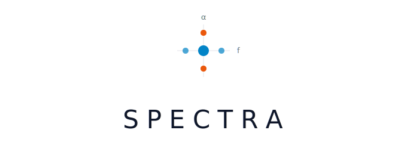

<p align="center">
  
</p>

# SPECTRA

Realistic radar and communication waveform generation with PyTorch integration.

SPECTRA generates synthetic RF signals on-the-fly for training machine learning models. A Rust backend (via PyO3) handles compute-intensive DSP primitives while Python provides composition, impairments, and native PyTorch `Dataset` classes.

## Features

- **85+ waveform generators** — PSK, QAM, FSK, OFDM, ASK, AM, FM, chirp, polyphase codes, Zadoff-Chu, Barker, radar (pulsed, FMCW, pulse-Doppler, NLFM, stepped-frequency), spread spectrum (DSSS, FHSS, CDMA, THSS), 5G NR (OFDM, SSB, PDSCH, PUSCH, PRACH), and aviation/maritime (ADS-B, Mode S, AIS, ACARS, DME, ILS)
- **Multi-function emitters** (`ScheduledWaveform`) — single emitters that interleave multiple modes on a schedule (MFR search/track, multi-PRF pulse-Doppler, frequency-agile, RadCom); see [the user-guide page](docs/user-guide/multifunction-emitters.md).
- **24 composable channel impairments** — AWGN, frequency offset, phase noise, IQ imbalance, fading, TDL, MIMO, PA nonlinearity, timing, spectral effects, and more (plus **RadarClutter** for 2-D radar matrices)
- **MIMO multi-antenna support** — flat Rayleigh and TDL channels, spatial correlation (Kronecker model), ULA steering vectors, seamless `NarrowbandDataset` integration
- **Geometry-driven propagation** — `Environment` + `Emitter` + `ReceiverConfig` compute per-link SNR, delay, Doppler, and delay spread; propagation models include free space, log-distance, COST231-Hata, Okumura-Hata, ITU-R P.525/P.676/P.1411, and 3GPP 38.901 (UMa/UMi/RMa/InH). `link_params_to_impairments()` auto-wires matching AWGN + Doppler + fading + TDL.
- **Cyclostationary signal processing** — Rust-accelerated SCD, SCF, CAF, cumulants, PSD, and energy detection transforms for signal analysis and feature extraction
- **Time-frequency analysis** — Wigner-Ville Distribution, Ambiguity Function, and Reassigned Gabor transforms for radar and comms research
- **Data augmentations** — CutOut, MixUp, CutMix, PatchShuffle, TimeReversal with dataset-level wrappers for soft-label training
- **Class balancing** — built-in `class_weights` parameter and `balanced_sampler()` utility for imbalanced datasets
- **AMC classifiers** — `CyclostationaryAMC` with cumulant, cyclic-peak, or combined feature sets and scikit-learn tree-based backends
- **Wideband scene composition** — overlay multiple signals at different frequencies and times with physically correct complex-domain summation
- **Detection-ready labels** — ground truth in physical units (seconds, Hz) with automatic conversion to COCO-style bounding boxes on spectrograms
- **Benchmark configs** — 13 built-in YAML benchmarks (`spectra-18`, `spectra-40`, `spectra-18-wideband`, domain packs for 5G/radar/spread/protocol/airport/maritime/ISM, `spectra-df` for direction finding, plus channel-robustness and SNR-sweep configs); load with `load_benchmark()`, `load_channel_benchmark()`, or `load_snr_sweep()`
- **Interactive CLI** — `spectra-build` walks you through dataset configuration with guided prompts and exports benchmark-compatible YAML
- **Curriculum learning** — `CurriculumSchedule` ramps SNR, signal count, and impairment severity over training epochs
- **Streaming DataLoader** — `StreamingDataLoader` generates fresh data per epoch with deterministic seeding and curriculum integration
- **Deterministic generation** — every sample is reproducible from `(seed, index)`, safe across DataLoader workers
- **No disk I/O** — infinite variability generated on-the-fly in `__getitem__()`

## Installation

Requires Python 3.10+ and Rust 1.83+.

```bash
uv venv --python 3.12 .venv
source .venv/bin/activate
uv pip install maturin numpy pytest
uv pip install torch --index-url https://download.pytorch.org/whl/cpu
maturin develop --release
```

For the AMC classifiers (requires scikit-learn):

```bash
pip install 'spectra[classifiers]'
```

## Quick Start

### Narrowband (Automatic Modulation Classification)

```python
from torch.utils.data import DataLoader
from spectra import BPSK, QPSK, NarrowbandDataset, AWGN, Compose

dataset = NarrowbandDataset(
    waveform_pool=[QPSK(), BPSK()],
    num_samples=1000,
    num_iq_samples=1024,
    sample_rate=1e6,
    impairments=Compose([AWGN(snr_range=(5, 30))]),
    seed=42,
)

loader = DataLoader(dataset, batch_size=32, num_workers=4)
for iq_tensor, labels in loader:
    # iq_tensor: [B, 2, 1024] (I and Q channels)
    # labels: [B] (waveform class index)
    ...
```

### Wideband (Signal Detection)

```python
from spectra import (
    QPSK, BPSK, SceneConfig, WidebandDataset,
    AWGN, Compose, STFT, collate_fn,
)

config = SceneConfig(
    capture_duration=1e-3,
    capture_bandwidth=1e6,
    sample_rate=1e6,
    num_signals=(1, 5),
    signal_pool=[QPSK(), BPSK()],
    snr_range=(5, 30),
)

dataset = WidebandDataset(
    scene_config=config,
    num_samples=500,
    impairments=Compose([AWGN(snr_range=(10, 30))]),
    transform=STFT(nfft=256, hop_length=64),
    seed=42,
)

loader = DataLoader(dataset, batch_size=8, collate_fn=collate_fn)
for spectrograms, targets in loader:
    # spectrograms: [B, 1, freq_bins, time_bins]
    # targets: list of dicts with "boxes" [N, 4] and "labels" [N]
    ...
```

### CSP Classification

```python
from spectra import (
    BPSK, QPSK, PSK8, QAM16,
    CyclostationaryDataset, CyclostationaryAMC,
    SCD, Cumulants, AWGN, Compose,
)

# Multi-representation dataset with SCD + cumulant features
dataset = CyclostationaryDataset(
    waveform_pool=[BPSK(), QPSK(), PSK8(), QAM16()],
    num_samples=400,
    num_iq_samples=4096,
    sample_rate=1e6,
    representations={"scd": SCD(nfft=64, n_alpha=64), "cum": Cumulants()},
    impairments=Compose([AWGN(snr_range=(10, 25))]),
    seed=42,
)

# Train a random-forest AMC from cumulant features
amc = CyclostationaryAMC(feature_set="cumulants", classifier="random_forest")
amc.fit_from_dataset(dataset)
```

## API Overview

| Module | Key Classes / Functions | Purpose |
|---|---|---|
| `spectra.waveforms` | `BPSK`, `QPSK`, `QAM16`..`QAM1024`, `PSK8`..`PSK64`, `FSK`, `GMSK`, `OFDM`, `LFM`, `OOK`, `ASK4`..`ASK64`, `Tone`, `Noise`, `FM`, `AMDSB`, `PulsedRadar`, `FMCW`, `FHSS`, `CDMA_Forward`, `NR_OFDM`, `NR_SSB`, `ADSB`, `ModeS`, `AIS`, ... | 85+ baseband waveform generators |
| `spectra.impairments` | `AWGN`, `FrequencyOffset`, `PhaseNoise`, `IQImbalance`, `RayleighFading`, `TDLChannel`, `MIMOChannel`, `RappPA`, `SalehPA`, `Compose`, ... | 24 composable channel impairments (+ `RadarClutter`) |
| `spectra.scene` | `Composer`, `SceneConfig`, `SignalDescription`, `STFTParams`, `to_coco` | Multi-signal scene composition and labeling |
| `spectra.transforms` | `STFT`, `Spectrogram`, `SCD`, `SCF`, `CAF`, `Cumulants`, `WVD`, `AmbiguityFunction`, `ReassignedGabor`, `MixUp`, `CutMix`, `CutOut`, ... | Spectral transforms, CSP features, time-frequency, augmentations |
| `spectra.datasets` | `NarrowbandDataset`, `WidebandDataset`, `DirectionFindingDataset`, `WidebandDirectionFindingDataset`, `CyclostationaryDataset`, `MixUpDataset`, `CutMixDataset`, `balanced_sampler`, ... | PyTorch dataset classes with balancing and augmentation wrappers |
| `spectra.classifiers` | `CyclostationaryAMC` | Traditional AMC with cumulant/cyclic-peak features |
| `spectra.environment` | `Environment`, `Emitter`, `ReceiverConfig`, `Position`, `LinkParams`, `FreeSpacePathLoss`, `LogDistancePL`, `COST231HataPL`, `OkumuraHataPL`, `GPP38901UMa`/`UMi`/`RMa`/`InH`, `link_params_to_impairments`, `propagation_presets` | Geometry-driven path loss, link budgets, and auto-wired channel impairments |
| `spectra.antennas` | `IsotropicElement`, `ShortDipoleElement`, `HalfWaveDipoleElement`, `CosinePowerElement`, `YagiElement`, `MSIAntennaElement` | Antenna element pattern models |
| `spectra.arrays` | `AntennaArray`, `ula`, `uca`, `rectangular`, `CalibrationErrors` | Antenna array geometries with steering vectors |
| `spectra.algorithms` | `music`, `esprit`, `root_music`, `capon`, `delay_and_sum`, `mvdr`, `lcmv`, `matched_filter`, `ca_cfar`, `os_cfar` | DoA estimation, beamforming, and radar signal processing |
| `spectra.benchmarks` | `load_benchmark` | Reproducible benchmark dataset loader |
| `spectra.cli` | `spectra` (studio, generate, viz, build), `spectra-build` | Unified CLI: UI launch, headless generation, visualization, config wizard |
| `spectra.models` | `CNNAMC`, `ResNetAMC` | PyTorch model architectures for AMC |
| `spectra.metrics` | `confusion_matrix`, `accuracy`, `classification_report`, `per_snr_accuracy`, `bit_error_rate`, `symbol_error_rate`, `packet_error_rate` | Evaluation metrics |
| `spectra.profiles` | `EmitterProfile`, `Fixed`, `Uniform`, `LogUniform`, `Choice` | Emitter parameter distributions for realistic waveform sampling |
| `spectra.receivers` | `CoherentReceiver`, `PassthroughDecoder` | Receiver architectures with matched filter and decoding |
| `spectra.link` | `LinkSimulator`, `LinkResults` | BER/SER/PER vs. Eb/N0 link-level simulation |
| `spectra.targets` | `ConstantVelocity`, `ConstantTurnRate`, `SwerlingRCS`, `NonFluctuatingRCS` | Trajectory and RCS models for radar target simulation |
| `spectra.tracking` | `KalmanFilter`, `ConstantVelocityKF`, `RangeDopplerKF` | Kalman filter tracking for radar |
| `spectra.curriculum` | `CurriculumSchedule` | Progressive difficulty scheduling |
| `spectra.streaming` | `StreamingDataLoader` | Epoch-aware DataLoader with curriculum |
| `spectra.utils` | `frequency_shift`, `srrc_taps`, `low_pass`, `DatasetWriter`, ... | DSP utilities and I/O |

## Benchmarks

Load a reproducible benchmark with a single call:

```python
from spectra import load_benchmark

train_ds, val_ds, test_ds = load_benchmark("spectra-18", split="all")
# 18-class narrowband AMC: 8000 train / 2000 val / 2000 test
```

**`load_benchmark(name)`** supports `task: narrowband`, `wideband`, or `direction_finding` (for example `spectra-df`). For `spectra-channel` use `load_channel_benchmark(name, condition=...)`. For `spectra-snr` use `load_snr_sweep(name, split=...)`.

Built-in names: `spectra-18`, `spectra-40`, `spectra-18-wideband`, `spectra-5g`, `spectra-radar`, `spectra-spread`, `spectra-protocol`, `spectra-airport`, `spectra-maritime-vhf`, `spectra-congested-ism`, `spectra-df`, `spectra-channel`, `spectra-snr`.

### Signal Builder CLI

Build a custom dataset config interactively — no Python code required:

```bash
spectra-build          # installed console script (config wizard only)
spectra build          # same wizard via the unified CLI
```

The unified `spectra` CLI also supports:

```bash
spectra studio         # launch SPECTRA Studio (Gradio UI)
spectra generate       # headless batch generation from YAML config
spectra viz            # quick IQ file visualization (FFT, IQ, waterfall, constellation)
```

The build wizard walks you through waveform selection, impairment presets, and dataset parameters, then outputs a benchmark-compatible YAML config file. Optionally generate the dataset to Zarr on the spot.

## Examples

See [`examples/`](examples/) for 30+ runnable scripts (with matching Jupyter notebooks for many) organized by domain. See [`examples/README.md`](examples/README.md) for the full annotated index.

| Folder | Highlights |
|---|---|
| `getting_started/` | Basic waveforms, impairments, transforms |
| `waveforms/` | Spread spectrum, protocols (ADS-B/Mode S/AIS/ACARS/DME/ILS), 5G NR (PDSCH/PUSCH/PRACH/SSB) |
| `impairments/` | Advanced impairments: colored noise, Doppler, IQ imbalance, TDL, PA, quantization |
| `transforms/` | Alignment transforms, time-frequency analysis (Reassigned Gabor, Ambiguity Function) |
| `datasets/` | Narrowband, wideband, folder/manifest, SNR sweep, augmentation, I/O, streaming + curriculum |
| `classification/` | Full pipeline, CSP classification, narrowband CNN/ResNet AMC |
| `cyclostationary/` | SCD/SCF/CAF/cumulants, S³CA vs SSCA, CWD, WVD |
| `antenna_arrays/` | DoA (MUSIC/ESPRIT), beamforming (DAS/MVDR/LCMV), wideband DF, antenna patterns, geometries |
| `radar/` | Matched filter + CFAR, MTI/Doppler, end-to-end pipeline with tracking |
| `communications/` | Link simulator, BER/SER/PER curves |
| `environment/` | Propagation + link budgets, terrestrial models, urban 5G scene with auto-impairments |
| `benchmarks/` | Loading and evaluating built-in benchmarks |
| `verification/` | Signal-generation verification scripts (BPSK, QAM16 Gray code, GMSK, LFM, ADS-B, Barker-13, 5G NR PSS) |

## Running Tests

```bash
# All tests
pytest

# Rust FFI tests only
pytest -m rust

# Cyclostationary signal processing tests
pytest -m csp

# Signal-generation verification suite
pytest -m verification

# File I/O tests (requires spectra[io])
pytest -m io

# Benchmark output format and logic tests
pytest -m benchmark

# Single test
pytest tests/test_waveforms_psk.py::TestQPSKWaveform::test_bandwidth -v
```

## License

MIT
