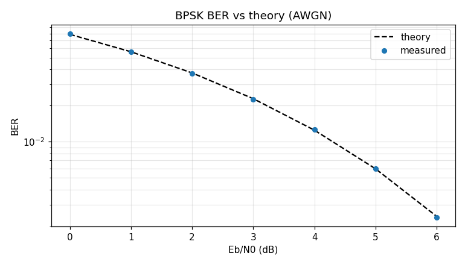
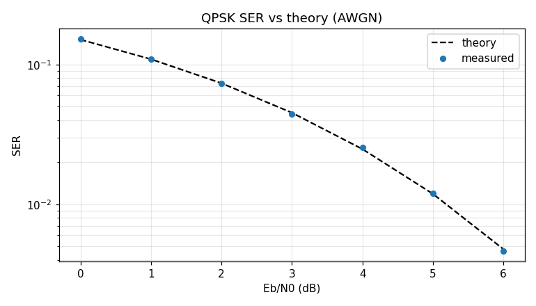
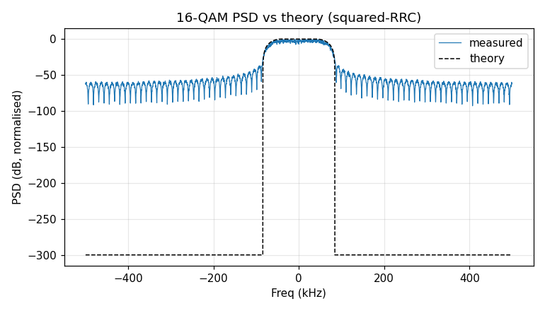
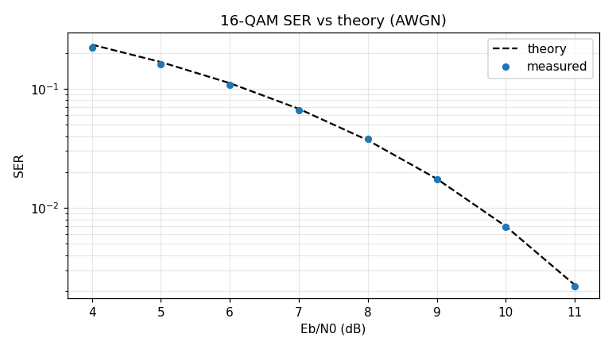
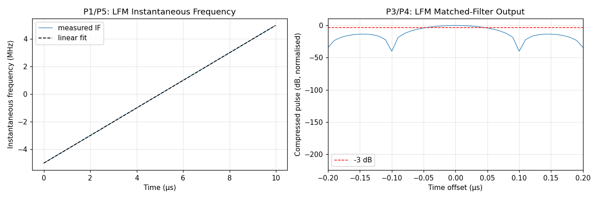
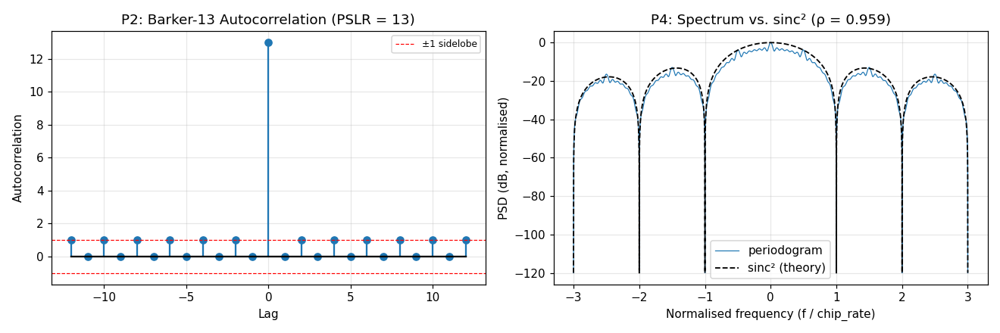
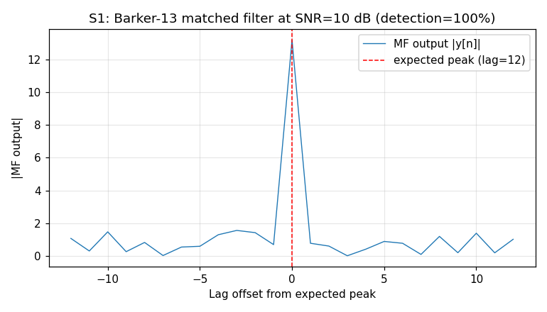
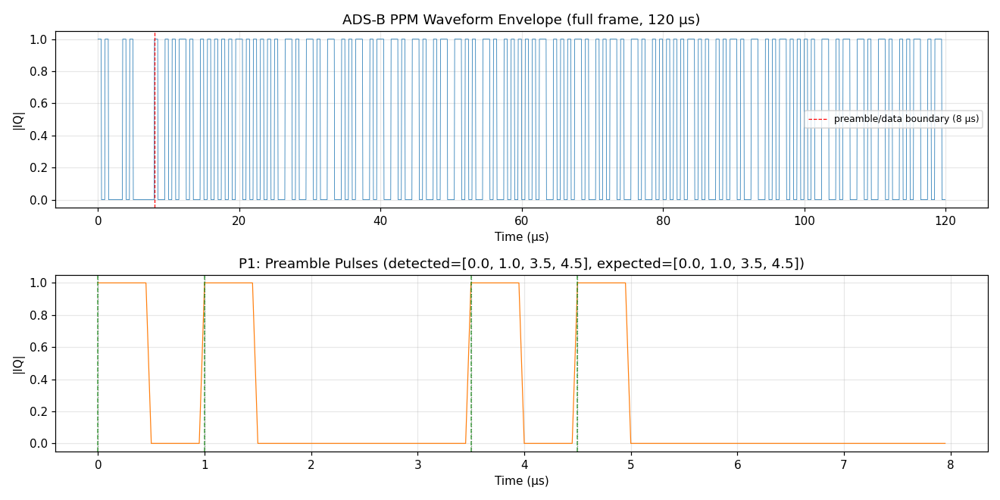

# SPECTRA Signal Generation — Verification Suite

An evidence-based verification suite for SPECTRA's core waveform generators,
designed to convince an RF / communications expert that generated signals are
correct.

Every claim in every script:

1. carries a numbered ID (`P1`, `S2`, …),
2. is asserted with a literature- or standards-grounded tolerance,
3. is annotated with a citation key that resolves to [`REFERENCES.md`](REFERENCES.md).

If you find a citation that doesn't match the code, file an issue — that's a bug.

## Layout

| File | Purpose |
|------|---------|
| `_verify_helpers.py` | Result accounting, theoretical formulas, measurement primitives, plotting. Example-local — not part of the public API. |
| `REFERENCES.md` | Canonical bibliography. Parsed at startup; unresolved keys raise. |
| `verify_<waveform>.py` | Per-waveform proof scripts. Each exposes `properties()` and `performance(full)`. |
| `verification_suite.ipynb` | Master narrative notebook. Imports every script. |

## Methodology

Two tiers per waveform:

- **Property checks (`P*`)** — deterministic, fast (< 1 s), always run in CI.
  These are exact equalities or inequalities that follow from the waveform's
  mathematical definition or from a published standard.
- **Performance checks (`S*`)** — statistical, slow-gated (`@pytest.mark.slow`).
  Monte-Carlo / sampling-bound checks: BER vs theory, EVM at fixed SNR,
  ACLR over long captures, PAPR percentiles.

Every numeric tolerance carries a citation. No "industry rule of thumb" tolerances.

## Running

```bash
# Single waveform, fast mode
python examples/verification/verify_qpsk.py

# Single waveform, publication-grade sample sizes
python examples/verification/verify_qpsk.py --full

# Whole CI tier (property checks)
pytest -m verification tests/verification/

# Slow tier (performance checks)
pytest -m "verification and slow" tests/verification/

# Notebook smoke
pytest --nbmake examples/verification/verification_suite.ipynb
```

## Per-Waveform Evidence

### BPSK — `verify_bpsk.py`

Linear binary modulation. Strongest evidence:

- **P4** PSD shape correlation ≥ 0.99 with theoretical squared-RRC (Proakis 2008, eq. 9.2-37)
- **S1** BER vs Eb/N0 over AWGN, max |Δ| ≤ 0.5 dB at full mode (Proakis 2008, eq. 4.3-13)

```python
from spectra import BPSK
wf = BPSK(samples_per_symbol=8, rolloff=0.35)
iq = wf.generate(num_symbols=4096, sample_rate=1e6, seed=0)
```

```bash
python examples/verification/verify_bpsk.py        # quick mode
python examples/verification/verify_bpsk.py --full # publication-grade
```


*BPSK PSD overlay: measured Welch PSD vs. theoretical squared-RRC (Proakis eq. 9.2-37). Correlation ≥ 0.99.*


*BPSK BER measured over AWGN vs. theoretical Q(√(2·Eb/N0)) (Proakis eq. 4.3-13).*

---

### QPSK — `verify_qpsk.py`

Linear M-ary PSK modulation. Symbols at ±π/4, ±3π/4 on the unit circle, pulse-shaped with an RRC filter. Strongest evidence:

- **P4** PSD shape correlation ≥ 0.99 with theoretical squared-RRC (Proakis 2008, eq. 9.2-37)
- **S1** SER vs Eb/N0 ∈ [0, 9] dB, max |Δ| ≤ 0.8 dB (Proakis 2008, eq. 4.3-15)

```python
from spectra import QPSK
wf = QPSK(samples_per_symbol=8, rolloff=0.35)
iq = wf.generate(num_symbols=4096, sample_rate=1e6, seed=0)
```

```bash
python examples/verification/verify_qpsk.py
python examples/verification/verify_qpsk.py --full
```


*QPSK PSD overlay: measured Welch PSD vs. theoretical squared-RRC (Proakis eq. 9.2-37). Correlation ≥ 0.99.*


*QPSK SER measured over AWGN vs. theoretical 2Q(√(2·Eb/N0)) (Proakis eq. 4.3-15).*

---

### 16-QAM — `verify_qam16.py`

High-order linear modulation with 16 energy-normalised points (levels ±1/√10, ±3/√10). The Rust modulator uses row-major indexing rather than Gray coding; the Gray adjacency check is omitted and documented. Strongest evidence:

- **P5** PSD shape correlation ≥ 0.99 with theoretical squared-RRC (Proakis 2008, eq. 9.2-37)
- **S1** SER vs Eb/N0 ∈ [4, 11] dB, max |Δ| ≤ 1.0 dB (Proakis 2008, eq. 4.3-30)

```python
from spectra import QAM16
wf = QAM16(samples_per_symbol=8, rolloff=0.35)
iq = wf.generate(num_symbols=4096, sample_rate=1e6, seed=0)
```

```bash
python examples/verification/verify_qam16.py
python examples/verification/verify_qam16.py --full
```


*16-QAM PSD overlay: measured Welch PSD vs. theoretical squared-RRC (Proakis eq. 9.2-37). Correlation ≥ 0.99.*


*16-QAM SER measured over AWGN vs. theoretical formula (Proakis eq. 4.3-30).*

---

### GMSK — `verify_gmsk.py`

CPM with Gaussian pulse shaping; modulation index h = 0.5. Strongest evidence:

- **P1** Constant envelope: std(|s|)/mean(|s|) ≤ 1e-3 (CPM definition)
- **P2** Steady-state |Δφ|/symbol = π/2 within 1 % on a constant-bit stream (Proakis 2008, §4.4-3)
- **P4** PSD 3-dB main lobe ≈ 0.27·R_s for BT=0.3 (Laurent 1986, §III)
- **P5** 99 % OBW ≈ 0.92·R_s (GSM/3GPP BT=0.3 GMSK reference; ITU SM.328 §3)

```python
from spectra import GMSK
wf = GMSK(samples_per_symbol=8, bt=0.3)
iq = wf.generate(num_symbols=4096, sample_rate=1e6, seed=0)
```

```bash
python examples/verification/verify_gmsk.py        # quick mode
python examples/verification/verify_gmsk.py --full # publication-grade
```

No BER figure is rendered. A per-bit matched filter loses ~26 dB on BT=0.3 GMSK because the Gaussian-shaped phase pulse spreads ISI over ~3 bit intervals; a proper coherent receiver (Laurent decomposition or Viterbi CPM) is tracked as follow-on work.

---

### OFDM — `verify_ofdm.py`

Multicarrier waveform. The script builds a reference from NumPy IFFT independently of `sp.OFDM` so that deviations from the mathematical definition are detectable. Strongest evidence:

- **P1** Subcarrier orthogonality: FFT recovers exact input symbols (Proakis 2008, §4.6)
- **P2** CP correlation peak at lag N_FFT (van de Beek 1997, §III)
- **S1** EVM at SNR = 40 dB ≤ 2 % RMS after CP removal + ZF equalisation (3GPP 38.104, §B.2)

```bash
python examples/verification/verify_ofdm.py
python examples/verification/verify_ofdm.py --full
```

No figure is saved; all results are printed as a pass/fail table.

---

### NR PSS — `verify_nr_pss.py`

5G NR Primary Synchronisation Signal. The Rust implementation (`nr.rs`) uses initial state [1,1,1,0,1,1,0] matching 3GPP TS 38.211 §7.4.2.2.1; the plan's reference had this wrong and was corrected here. Strongest evidence:

- **P1** Sample-exact equality with 3GPP table for NID2 ∈ {0, 1, 2}
- **P3** Auto-correlation peak ≥ 30× median |sidelobe|

```bash
python examples/verification/verify_nr_pss.py
python examples/verification/verify_nr_pss.py --full
```

All checks are deterministic; no figure is saved.

---

### NR SSS — `verify_nr_sss.py`

5G NR Secondary Synchronisation Signal. Gold-sequence equality with 3GPP TS 38.211 §7.4.2.3.1; plan, standard, and Rust implementation all agree on initial state [1,0,0,0,0,0,0]. Strongest evidence:

- **P1** Sample-exact equality with 3GPP Gold sequence for sampled (NID1, NID2) pairs
- **P3** Max |cross-correlation| between distinct cell IDs ≤ 0.70 × auto-peak

```bash
python examples/verification/verify_nr_sss.py
python examples/verification/verify_nr_sss.py --full
```

All checks are deterministic; no figure is saved.

---

### LFM — `verify_lfm.py`

Linear FM (chirp) sweeping from f_0 to f_0 + B over pulse width T. Compression gain is verified as 10·log10(N_samples) — the correct discrete-time formula for oversampled waveforms (Fs > B), not the TBP-based formula. Strongest evidence:

- **P1** IF linear ramp: residual std after linear detrend ≤ 2 % of B
- **P3** Matched-filter compression gain = 10·log10(N_samples) within 0.5 dB (Levanon 2004, eq. 5.5)

```python
from spectra import LFM
wf = LFM(bandwidth_fraction=0.1, samples_per_pulse=1000)
iq = wf.generate(sample_rate=100e6, seed=0)
```

```bash
python examples/verification/verify_lfm.py
python examples/verification/verify_lfm.py --full
```


*LFM IF ramp (P1) and matched-filter main-lobe width (P4). Linear detrend residual and 3-dB width measured with sub-sample interpolation.*

---

### Barker-13 — `verify_barker13.py`

Phase-coded radar pulse with sequence [+1+1+1+1+1−1−1+1+1−1+1−1+1]. Strongest evidence:

- **P1** Exact equality with canonical Barker-13 (Levanon 2004, Tab. 6.1)
- **P2** PSLR (peak / max-sidelobe) exactly = 13 (Levanon 2004, eq. 3.32)
- **S1** Pulse-compression detection rate ≥ 98 % at SNR = 10 dB (Levanon 2004, §3)

```python
from spectra import Barker13
wf = Barker13(samples_per_chip=4)
iq = wf.generate(sample_rate=1e6, seed=0)
```

```bash
python examples/verification/verify_barker13.py
python examples/verification/verify_barker13.py --full
```


*Barker-13 autocorrelation (P2: PSLR = 13) and spectral envelope (P4: sinc² correlation ≥ 0.95).*


*Barker-13 pulse-compression detection rate vs SNR (S1: ≥ 98 % at 10 dB).*

---

### ADS-B — `verify_adsb.py`

Aviation protocol (1090ES) with PPM encoding at chip rate 2 Mchips/s. The correct sample rate is 2 × SPC × 1 MHz (the plan template had SPC × 1 MHz, which places preamble pulses at wrong µs offsets). Strongest evidence:

- **P3** CRC-24 round-trip residue = 0 with G(x) = 0x1FFF409 (RTCA DO-260B §2.2.3.2.1.2)
- **P4** PPM round-trip: decoded bits → CRC residue = 0 (RTCA DO-260B §2.2.3.2.2)

```python
from spectra import ADSB
wf = ADSB(samples_per_chip=10)
iq = wf.generate(seed=0)  # sample_rate = 20e6 (2 * SPC * 1 MHz)
```

```bash
python examples/verification/verify_adsb.py
python examples/verification/verify_adsb.py --full  # (no extra checks)
```


*ADS-B preamble pulse positions (P1, P4) and CRC-24 residue verification (P3). All checks are deterministic.*

---

## Notes on Findings

This suite surfaced two implementation observations:

1. **GMSK previously produced h_eff = 0.5/sps = 0.0625, not the standard h = 0.5.** Root cause: zero-insertion upsampling combined with a sum-normalised Gaussian filter in `python/spectra/waveforms/fsk.py`. Fixed by switching to repeat-upsampling (matching `MSK.generate` and `FSK.generate`); verifier now uses textbook MSK tolerances (P2 expects π/2 rad/symbol; P4 expects 0.27·R_s main-lobe BW; P5 expects 0.92·R_s 99 % OBW). A coherent BT=0.3 GMSK BER row is deferred (per-bit matched filter loses ~26 dB; needs a Laurent or Viterbi CPM detector). Regression guarded by `tests/test_waveforms_fsk.py::TestGMSKModulationIndex`.

2. **16-QAM uses row-major indexing, not Gray coding** (`rust/src/modulators.rs`). Gray adjacency check omitted from `verify_qam16.py`; limitation is documented inline.

## Waveform coverage (see Per-Waveform Evidence above)

| Script | Class | Strongest evidence |
|--------|-------|--------------------|
| `verify_bpsk.py`     | Linear binary     | BER-vs-theory exact; PSD correlation ≥ 0.99 |
| `verify_qpsk.py`     | Linear M-ary      | SER-vs-theory; unit-circle constellation; ACLR |
| `verify_qam16.py`    | Linear high-order | SER-vs-theory; EVM; energy-normalised constellation |
| `verify_gmsk.py`     | CPM               | h = 0.5 steady-state; constant envelope; PSD/OBW match BT=0.3 references |
| `verify_ofdm.py`     | Multicarrier      | Subcarrier orthogonality; CP correlation; EVM |
| `verify_nr_pss.py`   | Spec sequence     | Sample equality with 3GPP TS 38.211 §7.4.2.2.1 |
| `verify_nr_sss.py`   | Spec sequence     | Gold-sequence equality with 3GPP TS 38.211 §7.4.2.3.1 |
| `verify_lfm.py`      | Radar FM          | IF linear ramp; matched-filter gain; 3-dB width |
| `verify_barker13.py` | Radar code        | PSLR exactly = 13; detection rate ≥ 98 % at 10 dB |
| `verify_adsb.py`     | Protocol w/ CRC   | CRC-24 byte equality with RTCA DO-260B |

Future expansion (8PSK, M-PSK ≥ 16, FSK, NR DMRS/PRACH, FMCW, NLFM,
polyphase codes, Mode S, AIS, ACARS, spread spectrum, AM/FM) follows
the same pattern.
